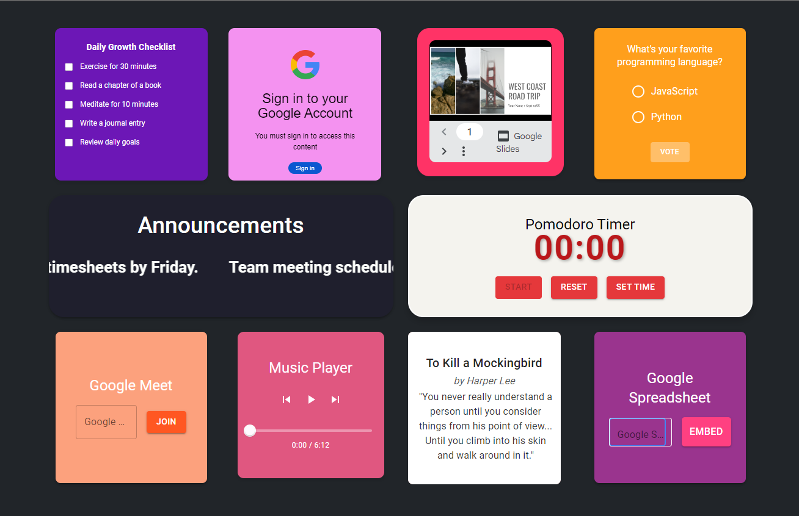

# Digital Notice Board - Chrome Extension

Welcome to the Digital Notice Board, a Chrome extension designed to enhance collaboration and communication across teams within a company. This extension sets your browser's homepage to a dynamic and interactive digital notice board featuring 10 essential widgets. 

## Problem Statement

In a rapidly scaling company, employees often lose context about the happenings across the organization, which can hinder effective collaboration. While communication tools like Slack provide some solutions, they do not fully address the problem. 

To foster better communication and collaboration, the Digital Notice Board offers a more comprehensive solution through a browser homepage extension. This innovative idea, inspired by the insights of a brilliant boss (who may or may not have coerced this acknowledgment), replaces the traditional physical notice board with a digital one, providing:

- Enhanced collaboration across teams
- More effective communication through polls and visualizations, rather than just text

## Features

The Digital Notice Board includes the following widgets, all displayed on the user's homepage:

1. **Google Slides**: Integrate your presentations directly onto your homepage.
2. **Pomodoro Timer**: Boost productivity with this time management tool.
3. **Google Calendar**: Stay on top of your schedule and never miss a meeting.
4. **Music Player**: Enjoy your favorite tunes while you work.
5. **Announcements**: Keep everyone informed with the latest updates.
6. **Google Meet**: Quickly join meetings with a single click.
7. **Google Spreadsheet**: Access important data and spreadsheets seamlessly.
8. **Poll**: Gather opinions and feedback from your team.
9. **Quote from a Book**: Get daily inspiration from a curated selection of book quotes.
10. **Daily Growth Tracker**: Track your personal and professional growth daily.

## Installation

1. **Clone the repository**: 
    ```bash
    git clone https://github.com/yourusername/digital-notice-board.git
    ```
2. **Navigate to the project directory**:
    ```bash
    cd digital-notice-board
    ```
3. **Install dependencies**:
    ```bash
    npm install
    ```
4. **Build the project**:
    ```bash
    npm run build
    ```
5. **Load the extension into Chrome**:
    1. Open Chrome and go to `chrome://extensions/`.
    2. Enable "Developer mode" by toggling the switch in the top-right corner.
    3. Click "Load unpacked" and select the `build` directory of the project.

## Usage

Once installed, open your browser, and you will see the Digital Notice Board as your homepage. Interact with the widgets to boost your productivity and stay informed.

## Screenshots



## Contact

For any questions or suggestions, please contact Ishan Gupta at [ishan250702@gmail.com](mailto:ishan250702@gmail.com).

---

Thank you for using the Digital Notice Board! We hope it enhances your team's communication and collaboration.

---

[](https://www.linkedin.com/in/ishan-gupta-493144227)
[](https://github.com/ishangupta2507)
